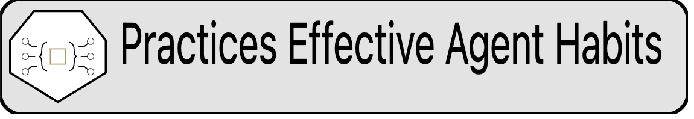
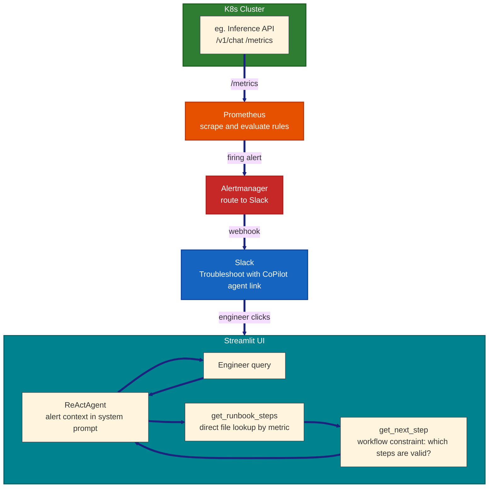

<h1 align="left">SRE incident Co-Pilot </h1>

When an alert fires, engineers usually start from scratch, finding the runbook, checking metrics, figuring out what to try first. This tool tries to shorten that gap.
It includes a Streamlit agent chat interface that opens from the alert link, pre-loaded with context. It suggests runbook steps and diagnostic commands, and can propose K8s manifest changes.
Inspired by [The Seven Habits of Effective Agentic Systems](https://agent-habits.github.io/habits/) by Inbar Rose and [Splunk State of Observability 2025](https://www.splunk.com/en_us/blog/observability/state-of-observability-2025.html).

## Architecture



## Quick Start

```bash
# 1. Install dependencies
pip install -r requirements.txt

# 2. Start the chatbot
streamlit run alert_app.py --server.port 8501

# 3. Open in browser
open http://localhost:8501/?alert_id=demo-001&service=inference-api&metric=p99_latency&severity=critical
```

### Full E2E with Prometheus + Slack

```bash
# Build inference API image and deploy to Kind
docker build -t inference-api:latest inference-api/
kind create cluster --config k8s/kind-config.yaml
kind load docker-image inference-api:latest
kubectl apply -f k8s/

# Port-forward services
kubectl port-forward svc/inference-api 8081:8000 &
kubectl port-forward svc/prometheus 9091:9090 &
kubectl port-forward svc/slack-mock 5000:5000 &

# Trigger an alert
curl -X POST http://localhost:8081/debug/set-latency \
  -H "Content-Type: application/json" -d '{"latency_ms": 2000}'
# Send traffic, then check http://localhost:9091/alerts

# Simulate Slack notification
python simulate_alert.py
```

## Project Structure

```
alert-chatbot/
├── alert_chatbot.py           # ReActAgent + 5 read-only FunctionTools
├── alert_app.py               # Streamlit UI with alert context pre-loading
├── telemetry.py               # Structured JSON audit logger
├── simulate_alert.py          # Send a mock Slack alert with chatbot link
├── slack_webhook_server.py    # Local Slack webhook mock for testing
├── test_e2e.sh                # Automated end-to-end test script
├── requirements.txt
├── Makefile
├── data/runbooks/*.md         # 6 sample runbook documents
├── inference-api/
│   ├── app.py                 # FastAPI with Prometheus metrics + debug endpoints
│   └── Dockerfile
├── prometheus/
│   ├── alert.rules.yml        # Alert rules for inference API
│   └── alertmanager.yml       # Config for Slack routing
└── k8s/
    ├── kind-config.yaml
    ├── inference-api-deploy.yaml
    ├── prometheus-deploy.yaml
    ├── prometheus-rbac.yaml
    └── alertmanager-deploy.yaml
```

## Tools & Dependencies

| Component | Technology |
|---|---|
| Agent framework | `llama-index-core` with `ReActAgent` |
| LLM | Ollama (`llama3.1`) |
| Runbook retrieval | Direct file lookup by metric name |
| Web UI | Streamlit |
| Inference API | FastAPI + `prometheus_client` |
| Kubernetes | Kind (local cluster) |
| Monitoring | Prometheus + Alertmanager |
| Dashboard | Grafana (importable dashboard at `config/sre-grafana-dashboard.json`) |

---

## How the 7 Habits Apply

### Habit 1 - Clearly Bounded Role

Agents should have explicit, narrow roles defined by what they can do, what decisions they cannot make, and what authority they never hold, so they remain trustworthy, auditable, and composable.

The agent is responsible for:
- Loading the runbook for the firing metric
- Running the diagnostic workflow constraint (`get_next_step`) to determine valid next steps
- Suggesting read-only diagnostic commands (`suggest_diagnostic_command`)
- Proposing remediation options (`assess_options`) and manifest changes (`propose_manifest`) for engineer review

The agent is explicitly **not** responsible for:
- Executing any command or mutation, all tools return text/JSON only
- Deciding the diagnostic sequence, `get_next_step` constrains valid steps in code
- Escalating before diagnostics are complete, code-level guards on `assess_options`/`propose_manifest` reject early escalation calls
- Applying changes, `propose_manifest` writes to disk only after UI approval; no tool calls `kubectl`, `curl`, or mutates state

This bounded role makes the agent predictable under stress, auditable in postmortems, and safe to compose with the existing on-call pipeline without unexpected side effects.

### Habit 2 - Embedded in Workflows

The value of an agent is not measured by how independently it operates, it is measured by how well it fits. This agent does not create its own workflow; it slots into the existing on-call alert pipeline.

```
Prometheus fires → Alertmanager routes to Slack → engineer clicks link → agent appears with alert context pre-loaded
```

The agent receives input at a natural decision point (when an engineer opens an alert), produces text output that fits an existing interface (chat), and hands off cleanly to the engineer who decides whether to act. It augments the workflow without redefining it, translating Prometheus metrics and runbook content into actionable suggestions, then stepping aside. Adoption is natural because nothing about the alert workflow changes; the agent just makes it faster to find the right next step.

### Habit 3 - Explicit Constraints

Constraints are not guardrails added after the fact, they are part of the agent's interface. They define which actions are allowed by default, which require deferral, and which are forbidden entirely. And they must be enforced by the system, not merely described in prompts.

| Constraint | How it's enforced |
|---|---|
| No direct mutation | `FunctionTool` wraps only Python functions that return text, no tool exists for restart, failover, or any state change |
| No shell execution | `suggest_diagnostic_command` returns a string, the system never calls `os.system()` or `subprocess` |
| Alert context from URL params | Alert data is parsed from the URL query string, no API calls, no network permissions needed |
| `max_iterations=12` | `MAX_ITERATIONS=12` covers the full diagnostic loop (runbook + 3 step iterations + assessment) with buffer cycles |
| Hallucinated tool rejection | `_extract()` guard discards malformed tool calls and joins list-type args into comma-separated strings; `get_next_step` warns when unknown step IDs are passed |
| Step ID enforcement | `get_next_step` returns a `warning` field listing ignored IDs if the agent passes invented step names instead of exact IDs from `valid_next_steps` |
| Mandatory step guards | `assess_options` and `propose_manifest` check `completed_steps` against the diagnostic workflow internally; return error dict if mandatory diagnostic steps are incomplete |
| Irreversible action flagging | `_assess_irreversibility()` deterministically scans the agent's output for keywords (`scale`, `restart`, `delete`, `failover`, etc.) and sets `has_irreversible_suggestion`; enforced by code, not left to the LLM |
| Manifest proposals are gated | `propose_manifest` returns YAML text; the manifest is written to a file only after UI approval, never by the agent. The updated manifest is never deployed by the agent. |

These constraints make authority legible. An engineer inspecting the codebase can see exactly what the agent can and cannot do. Permissions can be audited, behavior is predictable under stress, and failure modes are bounded.

### Habit 4 - Defers Irreversibility

**Deferral** is the mechanism by which the agent acknowledges uncertainty. It contributes intelligence while preserving human authority over actions that cannot be easily undone. No destructive action is ever automated - the agent can suggest a restart or propose a manifest change, but it never executes or applies anything. The engineer remains the decision-maker for anything that matters.

**Irreversibility** is detected deterministically after the agent responds, using keyword scanning on the agent's output text. This is more reliable than asking the model to self-assess, since small LLMs (3B-9B) inconsistently produce structured irreversibility declarations.

The `AgentResponse` Pydantic model carries the result:
```python
class AgentResponse(BaseModel):
    reasoning: str                     # narrative shown to the engineer
    has_irreversible_suggestion: bool  # determined post-hoc
    irreversible_reason: str | None    # one sentence explaining why
    confidence: float                  # 0.0-1.0, derived from workflow step completeness
    manifest_yaml: str                 # extracted YAML if agent proposes a manifest
```

**Confidence** is set based on whether all mandatory diagnostic steps are complete (from `get_next_step().all_mandatory_complete`), not from model output:
- `0.8` if all mandatory diagnostic steps are complete
- `0.3` if mandatory steps remain incomplete

When an irreversible action is suggested, the **UI prominently warns the engineer** with a red error banner showing the exact reason (e.g., "⚠️ Irreversible action detected: Suggestion involves: upgrade"). If the suggestion includes a manifest update, an approval gate with checkbox + "Approve" button is shown. For informational advisories without a manifest (e.g., upgrade decisions), a red warning is displayed - the engineer evaluates and acts independently.

**Example: Configuration change during incident:**
An agent proposes updating a K8s ConfigMap to mitigate a database bottleneck. It calls `propose_manifest(service="inference-api", change_type="config_update", params='{"key":"DB_POOL_SIZE","value":"50"}')` which returns the exact YAML manifest. The UI shows the proposed manifest in a code block with a red warning: "Irreversible action detected: Proposed manifest change for inference-api". The engineer reviews the YAML, confirms the checkbox ("I have reviewed the manifest and approve this change"), and clicks "Approve". On approval, the manifest is written to `/tmp/<alert_id>_manifest.yaml` - ready for `kubectl apply`. The agent never applies the change directly.

This is flagged as irreversible because a misconfigured manifest - for example, setting `DB_POOL_SIZE` too high or too low - could cause the service to crash or become unresponsive, leading to user-facing downtime. Once users cannot access the service, they may migrate to an alternative, and that loss of trust and adoption is effectively irreversible. The gate ensures the engineer stops to verify the YAML before applying. The impact of a bad deploy is not just a technical rollback - it is a business outcome that cannot be undone.

**Example: Kubernetes Upgrade Decision:**

**Scenario:** A recurring pod crash loop on `inference-api` has been traced to a known Kubernetes bug. The fix is a version upgrade - but upgrading carries its own risk. The agent suggests steps, but more importantly with tradeoff to defer the risk to a human successfully.

**Agent output:**

**Incident: `inference-api` crash loop - CrashBackOffLoop - 13:45 UTC**

Pods hitting a memory accounting bug in Kubernetes 1.26.3 is a known issue - fixed in 1.27.x. We're seeing it trigger specifically under the memory pressure patterns from our batch inference jobs.

Action options with tradeoffs:

**Upgrade to 1.27.x** - patches the bug directly. But 1.27.x ships with a change to the kubelet eviction manager that behaves differently under high pod density. We're running 180+ pods per node on several clusters. That's above the threshold where the new eviction behavior has caused instability in reported cases. We may fix this crash loop and introduce a different one.

**Hold at 1.26.3** - avoids upgrade risk. But the crash loop continues. The workaround is capping memory requests on batch jobs, which degrades inference throughput by an estimated 15-20%. That's a mitigation, not a fix. The underlying bug stays live.

Neither option is safe. Upgrading trades a known problem for a possible one. Not upgrading trades a fix for guaranteed degraded performance.

This is irreversible either way - upgrading could destabilise other workloads on the same cluster, and not upgrading locks in degraded throughput indefinitely. The right call depends on risk tolerance and business context the agent cannot evaluate. Hence sharing the full tradeoff and deferring the decision to you.

### Habit 5 - Optimizes for System Outcomes

Success is measured by MTTR and escalation rate, not alone on agent accuracy. The agent exists to put relevant runbook steps in front of the engineer faster than searching documentation. System-level outcomes are tracked via built-in feedback loops:

**Post-resolution feedback** - After each session, the engineer rates whether the suggestion helped (Yes / Partially / No) and  what they actually did to resolve it. This is logged as a `resolution_feedback` event in the audit trail alongside the full session context.

**Ticket Reopen tracking** - Each session checks prior audit logs for the same metric. If the same alert has fired before, the reopen count is displayed in the alert context and logged in the `session_start` event. Rising reopen counts for a metric contributing to backlog signal that the previous solution was incomplete - prompting a deeper review of the runbook or remediation steps.

**Closing ticket** - The alert remains firing until the engineer clicks the "Close ticket" button, which records the resolution time and computes MTTR as `close_time - alert_start_time`. This ensures the engineer must take explicit action in the tool rather than closing it externally, keeping the feedback loop intact. The result is displayed in the UI and logged as a `ticket_closed` event with `mttr_seconds` in the audit trail, enabling per-incident and aggregate MTTR analysis.  MTTR for sessions where the agent suggestion was followed is then compared against sessions where the agent suggestion did not help - making it possible to quantify whether the agent is actually shortening incidents or just adding noise.

**Grafana dashboard** - A metrics exporter (`metrics_exporter.py`) serves audit data as Prometheus metrics at `/metrics` on port `9100`. Prometheus scrapes it via `host.docker.internal:9100`. An importable Grafana dashboard (`config/sre-grafana-dashboard.json`) visualizes total sessions, reopen count by metric, MTTR per incident, ticket backlog (open vs closed tickets over time), and helpful vs unhelpful feedback - making agent effectiveness observable at a glance.

These mechanisms close the loop between agent suggestions and real incident outcomes, turning subjective "did it help" into an auditable, metric-traceable signal. By correlating feedback records with alert timestamps, MTTR with agent-assisted resolution can be compared against MTTR when the engineer reported the agent did not help - giving a direct, aggregate measure of whether the agent is helping.

### Habit 6 - Progress Through Structure

Maturity in an agentic system doesn't mean more autonomy, it means more predictability. Every structural decision here moves complexity out of the prompt and into code.

| Principle | How it's implemented in this project |
|---|---|
| **Tools, not knowledge** | `get_runbook_steps(metric)` reads the runbook file directly by metric name via `RUNBOOK_MAP`. No similarity search, no embedding gamble. When a runbook is updated, the agent picks it up instantly, no reindex needed.  |
| **State machine, not conversation state** | `DIAGNOSTIC_WORKFLOWS` defines the step sequence per metric in code (e.g. `p99_latency`: check health → check latency metrics → check pod resources → assess options → propose manifest). The agent calls `get_next_step(metric, completed_steps)` to find out what to do next. Returns `valid_next_steps` (constrained set, excludes escalation steps when mandatory diagnostics incomplete), `all_mandatory_complete`, and tracked `completed` steps. If the agent passes unknown step IDs (e.g. made-up section names), a `warning` field lists the ignored IDs. Agent picks from the list rather than following a fixed sequence. It never tracks where it is, the system does. State lives in tool arguments, not conversation history. |
| **Strict interfaces** | `propose_manifest` accepts a `change_type` enum (`scale_replicas`, `config_update`, `env_update`, `resource_limits`, `rollback`), not free-form text. Every tool returns typed JSON with `irreversible` and `reason` fields. `AgentResponse` is a Pydantic model, downstream consumers (UI, audit log, escalation gate) depend on known field names, not narrative text. |
| **Code beats model** | `_assess_irreversibility()` regex-scans for irreversible keywords (`upgrade`, `scale`, `restart`, `delete`, `rollback`) instead of asking the LLM to self-assess. |
| **Boring failure modes** | If no runbook exists for the metric, `get_runbook_steps` returns a clear error reason and the UI shows a predefined "No runbook available" message instead of letting the agent hallucinate. No creative lies, just predictable degradation. |
| **Bounded reasoning and context** | `MAX_ITERATIONS=12` covers the full diagnostic loop (runbook + 3 step iterations + assessment) with buffer cycles. The primary path uses direct file reads, avoiding context-window risk entirely for the main diagnostic flow. |
| **Compact prompt** | The system prompt is ~5 lines. All behavior lives in 5 tool functions with typed schemas. Logic moves out of the prompt and into code, which is the direction structure points. |

**Example 1: Direct Runbook Lookup via `get_runbook_steps`**

A p99 latency alert fires at 520ms on the inference-api service. The agent calls `get_runbook_steps(metric="p99_latency")`. The `RUNBOOK_MAP` dictionary maps the metric name directly to `data/runbooks/high-latency.md`. Python's `Path.read_text()` reads every byte of the file. The runbook says: "Step 1: `curl -s http://inference-api:8000/metrics | grep inference_latency`, check if p99 exceeds 500ms." The agent reports the exact command. No chunking, no embedding, no similarity gamble. The runbook was edited 30 seconds ago, the agent picks it up instantly.

**Example 2: Diagnostic State Machine via `get_next_step`**

An engineer walks through p99 latency diagnosis and has checked the health endpoint. The agent calls `get_next_step(metric="p99_latency", completed_steps="check_health_endpoint")`. `DIAGNOSTIC_WORKFLOWS` defines the sequence in code: `["check_health_endpoint", "check_latency_metrics", "check_pod_resources", "assess_options", "propose_manifest"]`. The system replies `{"valid_next_steps": ["check_latency_metrics", "check_pod_resources"], "mandatory_before_escalation": ["check_latency_metrics", "check_pod_resources"], "completed": ["check_health_endpoint"], "all_mandatory_complete": false}`. The agent picks from the list, it doesn't decide the sequence. Escalation steps (`assess_options`, `propose_manifest`) are excluded until all mandatory diagnostics complete. State lives in tool arguments, not conversation memory.

### Habit 7 - Visible Accountability

If you can't explain why a decision was made, you don't own the system, you're just watching it. Logs alone are transcripts; accountability requires tracing *intent* not just *output*. Every structural decision here ensures the "why" trails the "what."

| Principle | How it's implemented in this project |
|---|---|
| **Decision trace, not just logs** | Every agent run produces a `decision_trace` event recording `intent` (hardcoded from the alert metric URL param as `"diagnose_{metric}"`, not LLM-generated), `context_retrieved` (which runbook was looked up), `constraint_checks` (metric thresholds evaluated), `policies_applied` (all diagnostic workflow steps for the metric), and `tool_chain` (ordered list of tools actually called). This answers "why did the agent do that" without replaying the model. |
| **Trace ID links cause to effect** | Each agent run generates one `trace_id` (UUID) shared by all `tool_call`, `decision_trace`, and `interaction` events. Filter events by `trace_id` to reconstruct the full causal chain, from user query through tool calls to final response. |
| **Owner team on every tool** | Every tool is tagged with a human team in `TOOL_OWNERS`. If `propose_manifest` produces a bad YAML, the ticket routes to **Platform Team**, not "the AI team." This turns model failures into process improvement signals routed to the right team. |
| **Require policy citations in responses** | The system prompt instructs the agent to cite runbook sections by name (e.g. "Per [Section: Diagnostic Steps]..."). The `cited_sections` field is derived deterministically from the diagnostic workflow definition, each `get_next_step(metric, completed_steps)` call records which steps the agent completed. The step IDs are mapped to human-readable labels via `_derive_cited_sections()`. No text scanning, no heuristic matching, no model compliance risk. |
| **Decision metadata on every action** | Every tool call carries a deterministic `reason_code` derived from the tool name and arguments, the LLM has nothing to do with it. `suggest_diagnostic_command(service="inference-api", symptom="latency")` → `reason_code="diagnostic_command_for_latency"`. `propose_manifest(service="inference-api", change_type="scale_replicas")` → `reason_code="propose_scale_replicas_change"`. `get_next_step(metric="p99_latency", completed_steps="")` → `reason_code="query_first_diagnostic_step"`. Generated in `_derive_reason_code()` at the telemetry wrapper layer, not by the model. Zero model compliance risk. |

---

### Example: propose_manifest called with unsupported change_type

**How it will not work:**

Agent: "I cannot generate that manifest."

**How it will work:**

Agent: "Change type 'drain_node' is not supported per [allowed-manifest-changes.yaml]; accepted values: config_update, scale_replicas, env_update, resource_limits, rollback.

Select a supported change_type or escalate to [Platform Team per tool-owners.yaml] if a new change type needs to be added."

---

The full event catalog:

| Event | Key fields |
|---|---|
| `session_start` | `session_id`, `alert_id`, `metric`, `repeat_count` |
| `tool_call` | `trace_id`, `tool_name`, `owner_team`, `reason_code`, `args`, `result_preview`, `duration_ms` |
| `decision_trace` | `trace_id`, `intent`, `confidence`, `context_retrieved`, `constraint_checks`, `policies_applied`, `tool_chain` |
| `interaction` | `trace_id`, `user_query`, `agent_response`, `cited_runbooks`, `cited_sections`, `irreversibility fields` |
| `approval_requested` | `suggestion_text`, `irreversible_reason`, `user_confirmed` |
| `resolution_feedback` | `helped`, `actual_fix` |
| `ticket_closed` | `session_start`, `close_time`, `mttr_seconds` |

**Post-trace example**: What the audit trail looks like after an engineer asks "Help me troubleshoot inference-api"

```
# decision_trace (one per agent run)
trace_id=abc-123  intent=diagnose_p99_latency  confidence=1.0
  context_retrieved=["data/runbooks/high-latency.md"]
  constraint_checks=[{"metric":"p99_latency","threshold":"<500ms p99","unit":"ms","source":"alert_context"}]
  policies_applied=["Check Health Endpoint","Check Latency Metrics","Assess Remediation Options"]

# tool_call events (all share trace_id=abc-123)
trace_id=abc-123  tool=get_runbook_steps          owner=SRE Runbook Team
trace_id=abc-123  tool=get_next_step               owner=SRE Runbook Team
trace_id=abc-123  tool=suggest_diagnostic_command  owner=SRE Engineering   reason_code="diagnostic_command_for_latency"
trace_id=abc-123  tool=get_next_step               owner=SRE Runbook Team   completed_steps="check_health_endpoint"

# interaction (links to the same trace_id)
trace_id=abc-123  cited_runbooks=["data/runbooks/high-latency.md"]
                  cited_sections=["Check Health Endpoint"]
                  irreversibility={"has_irreversible_suggestion": false}
```

Every event carries the shared `trace_id`. Filter by it to reconstruct the full chain: the intent, which runbook was consulted, what tools were called in order (with owner team and deterministic `reason_code`), and which sections the agent actually cited in its response.

## Example Session

**Engineer clicks alert link → chatbot loads:**

```
Alert ID: PD-abc123
Service: inference-api
Metric: p99_latency
Severity: critical
Time: 2026-06-02T10:32:00Z
```

**Engineer types:** *"Help me troubleshoot inference-api"*

**Agent tool trace (verbose log):**
```
get_runbook_steps(metric="p99_latency")
→ Runbook: High Inference Latency ... (full file content)

get_next_step(metric="p99_latency", completed_steps="")
→ {"valid_next_steps": ["check_health_endpoint", "check_latency_metrics", "check_pod_resources"], "all_mandatory_complete": false}

suggest_diagnostic_command(service="inference-api", symptom="health")
→ curl -s http://inference-api:8000/health

get_next_step(metric="p99_latency", completed_steps="check_health_endpoint")
→ {"valid_next_steps": ["check_latency_metrics", "check_pod_resources"], "all_mandatory_complete": false}

suggest_diagnostic_command(service="inference-api", symptom="latency")
→ curl -s http://inference-api:8000/metrics | grep inference_latency

get_next_step(metric="p99_latency", completed_steps="check_health_endpoint,check_latency_metrics")
→ {"valid_next_steps": ["check_pod_resources"], "all_mandatory_complete": false}

suggest_diagnostic_command(service="inference-api", symptom="resources")
→ kubectl top pods -l app=inference-api

get_next_step(metric="p99_latency", completed_steps="check_health_endpoint,check_latency_metrics,check_pod_resources")
→ {"valid_next_steps": [], "all_mandatory_complete": true}
```

**What the engineer sees in the UI:**

```
✅ Suggestions - you must execute them manually

# 1. Check inference API health
  curl -s http://inference-api:8000/health
# 2. Check current latency metrics
  curl -s http://inference-api:8000/metrics | grep inference_latency
# 3. Check in-flight requests
  curl -s http://inference-api:8000/metrics | grep inference_requests_in_flight
# 4. Check pod resource usage
  kubectl top pods -l app=inference-api
# 5. Check pod logs for errors
  kubectl logs -l app=inference-api --tail=50
# 6. Verify model is loaded correctly
  kubectl exec deploy/inference-api -- curl -s http://localhost:8000/health
```


